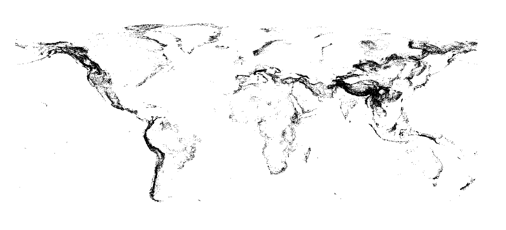

# Biomes

There are 10 `biomes` (all associated to a biome index from `0` to `9` + the `NoData` biome)

* `BuiltUp`     = 0 
* `Cropland`    = 1
* `Grassland`   = 2
* `Forest`      = 3
* `Arid`        = 4
* `Desert`      = 5
* `Mountain`    = 6
* `Wetland`     = 7
* `Ice`         = 8
* `Water`       = 9
* `NoData`      = 10

## Examples

Main Biomes around Nantes, France

Repartition of mountains biomes in the world 

