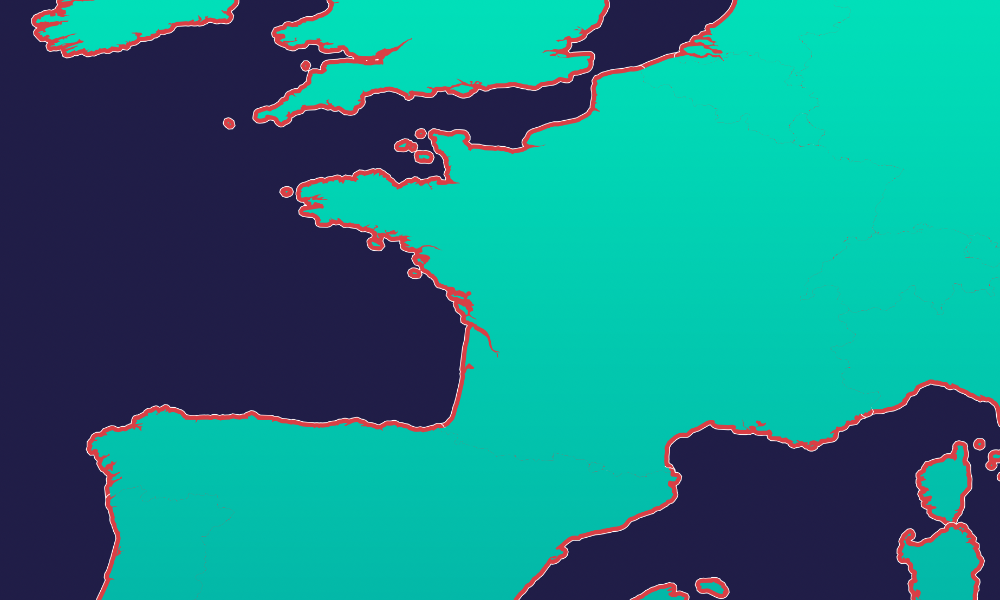

# Countries

The `/countries/` routes return countries in the world. 

:::tip
All `/countries/` routes accept an optionnal `lang` parameter, which defaults to `en`. This parameter changes the language of the `name` field for every returned countries. See [Langcodes](./langcodes) for availables `langcodes`
:::

## Primary Countries

In Terra, some Countries are marked as "primary". Those are the most significant countries available. There are 197 primary countries in total, and they are exactly the countries used in Neopolis (for Visas, etc).

:::info
By default, Terra returns all countries (primary included). To receive only primary countries only, add `primary_only=true` to your query.
:::

## Get all countries

```
GET https://terra.neopolis.app/countries/findAll?limit=100&offset=0&primary_only=true
```

<details>
<summary>Example Response</summary>
<p>

```
{
    "status": "ok"
    "data": [
        {
            "continent": "North America",
            "id": "ABW",
            "name": "Aruba",
            "population": 107000
        },
        (...)
    ]
}
```

</p>
</details>

## Get countries by ids

```
GET https://terra.neopolis.app/countries/findByIds?country_ids=ABW,ESP&lang=fr
```

<details>
<summary>Example Response</summary>
<p>

```
{
    "status": "ok"
    "data": [
        {
            "continent": "North America",
            "id": "ABW",
            "name": "Aruba",
            "population": 107000
        },
        (...)
    ]
}
```

</p>
</details>

:::info
All `country_ids` is a list of comma separate country_ids (3 letter ISO code, all uppercase). It is possible to have only 1 country in the list to get a specific country.
:::

## Find a country by location

This endpoint returns 0 or more countries that match the given location. For locations close to a border, all nearby countries are returned.

Note that this endpoint uses a "buffered" version of country borders: all borders have been expanded by 5 to 10km, to make the matching "more permissive" on country borders and coast lines. This buffer has been added to compensate for the unaccuracies of the underling polygon dataset.

```
GET https://terra.neopolis.app/countries/findByLocation?land_id=8818699b1bfffff&lang=fr&primary_only=true
```

OR

```
GET https://terra.neopolis.app/countries/findByLocation?lat=45.9&lng=1.5&lang=fr&primary_only=true
```

<details>
<summary>Example Response</summary>
<p>

```
{
    "status": "ok"
    "data": [
        {
            "continent": "North America",
            "id": "ABW",
            "name": "Aruba",
            "population": 107000
        },
        ...
    ]
}
```

</p>
</details>

The "buffer" can be seen in `red` in this image. Locations in the `green` and in the `red` area are considered "inside" the country.


 
 - `green` = the normal polygons for countries
 - `red` + `green` = the buffered polygons for countries