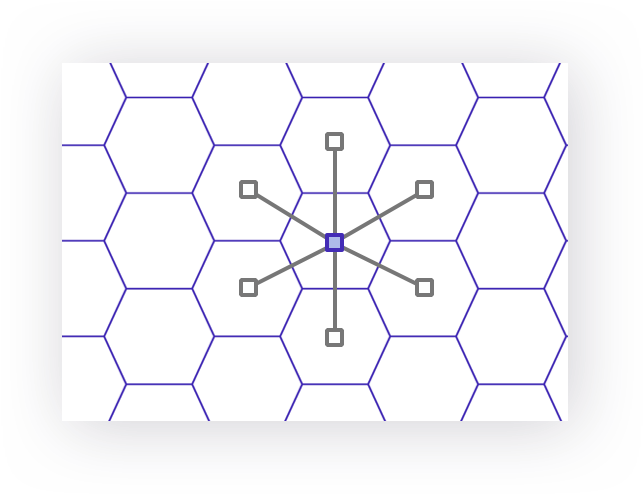

# Get Lands

The `/api/lands/` routes return `land` entities, which represent hexagonal terrains indexed on h3. All lands have an [h3 resolution](https://h3geo.org/docs/core-library/restable/) of 8. Lands are the building block of Terra and are associated to a `closest city` and to `biomes` .

## Get lands by ids

```
GET https://terra.neopolis.app/api/lands/findByIds?land_ids=8818699b1bfffff,8818698b1cfffff
```

<details>
<summary>Example Response</summary>
<p>

```
{
    "data": [
        {
            "biome_percents": {
                "built_up": 5,
                "cropland": 13,
                "forest": 7,
                "grassland": 75
            },
            "city_distance_km": 20,
            "closest_city_id": "FRA_Limoges",
            "closest_city_name": "Limoges",
            "contains_places_v2": false,
            "country_id": "FRA",
            "id": "8818699b1bfffff",
            "main_biome": "grassland",
            "region_name": "Limousin"
        }
        (...)
    ],
    "status": "ok"
}
```

</p>
</details>

## Get lands by location

```
GET https://terra.neopolis.app/api/lands/findByLocation?land_id=8818699b1bfffff&kring=1
```

OR

```
GET https://terra.neopolis.app/api/lands/findByLocation?lat=45.9&lng=1.5&kring=1
```

<details>
<summary>Example Response</summary>
<p>

```
{
    "data": [
        {
            "biome_percents": {
                "built_up": 5,
                "cropland": 13,
                "forest": 7,
                "grassland": 75
            },
            "city_distance_km": 20,
            "closest_city_id": "FRA_Limoges",
            "closest_city_name": "Limoges",
            "contains_places_v2": false,
            "country_id": "FRA",
            "id": "8818699b1bfffff",
            "main_biome": "grassland",
            "region_name": "Limousin"
        }
        (...)
    ],
    "status": "ok"
}
```

</p>
</details>

:::tip
The `kring` parameter is optionnal and defaults to 1 (which returns only 1 land)
:::

:::info
Getting a lands by location allow to use a `kring` . The `kring` is the "ring" of lands adjacent of the "center land". 
* A `kring` of `0` simply returned the center land
* A `kring` of `1` returns the center land + all lands directly adjacent to it (in this case, a total of `7` lands)
* A `kring` of `2` returns the same lands + all lands directly adjacent to them 

<details>
<summary>See kring = 1 illustration</summary>
<p>



</p>
</details>
:::
