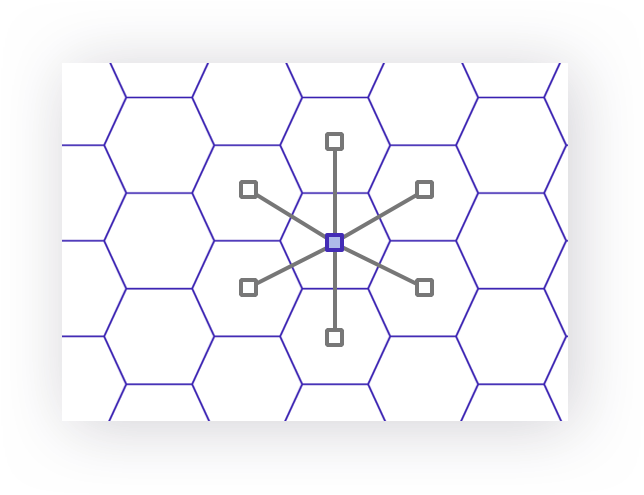

# Lands

The `/lands/` routes return `land` entities, which represent hexagonal terrains indexed on h3. All lands have an [h3 resolution](https://h3geo.org/docs/core-library/restable/) of 8. Lands are the building block of Terra and are associated to a `closest city` and to `biomes` .

:::info
What is the difference between `closest_city` and `primary_city` ?
- `closest_city` is the closest city to the land, that can be `primary` or not, and is not necessarily in the same country (used by Neoland)
- `primary_city` can only be a city maked as `primary` AND is always in the same country (used by Neopolis)

See [Primary Cities](./cities#primary-cities) for mor info
:::


## Get lands by ids

```
GET https://terra.neopolis.app/lands/findByIds?land_ids=8818699b1bfffff,8818698b1cfffff
```

<details>
<summary>Example Response</summary>
<p>

```
{
  "status": "ok",
  "data": [
    {
      "id": "8867736017fffff",
      "country_id": "ABW",
      "region_name": "ABW",
      "closest_city_id": "ABW_Oranjestad",
      "closest_city_name": "Oranjestad",
      "closest_city_distance_km": 13,
      "primary_city_id": "ABW_Oranjestad",
      "primary_city_name": "Oranjestad",
      "primary_city_distance_km": 13,
      "altitude": 33,
      "main_biome": "grassland",
      "biome_percents": {
        "arid": 8,
        "built_up": 25,
        "grassland": 67
      },
      "markers_count": 924
    }
    (...)
  ]
}
```

</p>
</details>

## Get lands by location

```
GET https://terra.neopolis.app/lands/findByLocation?land_id=8818699b1bfffff&k=1
```

OR

```
GET https://terra.neopolis.app/lands/findByLocation?lat=45.9&lng=1.5&k=1
```

<details>
<summary>Example Response</summary>
<p>

```
{
  "status": "ok",
  "data": [
    {
      "id": "8867736017fffff",
      "country_id": "ABW",
      "region_name": "ABW",
      "closest_city_id": "ABW_Oranjestad",
      "closest_city_name": "Oranjestad",
      "closest_city_distance_km": 13,
      "primary_city_id": "ABW_Oranjestad",
      "primary_city_name": "Oranjestad",
      "primary_city_distance_km": 13,
      "altitude": 33,
      "main_biome": "grassland",
      "biome_percents": {
        "arid": 8,
        "built_up": 25,
        "grassland": 67
      },
      "markers_count": 924
    }
  ]
}
```

</p>
</details>

:::tip
The `k` parameter is optionnal and defaults to 1 (which returns only 1 land)
:::

:::info
Getting a lands by location allow to use a `k` . The `k` is the "ring" of lands adjacent of the "center land". 
* A `k` of `0` simply returned the center land
* A `k` of `1` returns the center land + all lands directly adjacent to it (in this case, a total of `7` lands)
* A `k` of `2` returns the same lands + all lands directly adjacent to them 

<details>
<summary>See k = 1 illustration</summary>
<p>



</p>
</details>
:::
